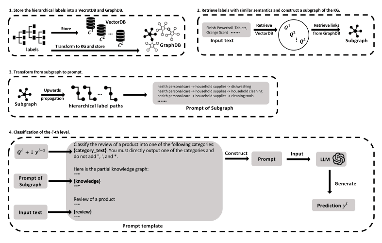

# KG-HTC: Integrating Knowledge Graphs into LLMs for Zero-shot Hierarchical Text Classification

## Introduction

Since Directed Acyclic Graph (DAG) can represent the hierarchical structure of labels in Hierarchical Text Classification (HTC), the combination of Large Language Models (LLMs) and knowledge graphs is especially well-suited for this purpose.  

We represent the taxonomy as a DAG-based knowledge graph and compute the cosine similarity between the text and the embeddings of labels at each level. By applying preset thresholds, candidate labels that are highly semantically relevant to the input text are chosen at every hierarchical level. 
Then, leveraging these candidate labels, the system dynamically retrieves the most pertinent subgraph from the complete label knowledge graph corresponding to the given text. 

For the retrieved subgraph, an upwards propagation algorithm is employed to systematically enumerate all possible hierarchical paths from the leaf nodes to the root, with each path representing a complete reversed hierarchical label sequence. These structured sequences are subsequently concatenated into a prompt, which is fed into a large language model to perform the zero-shot classification task. 




## How to run the code
1. Save database/graph_records.json to neo4j.
2. Create .env file. Input your OpenAI api and DB password.
```python
API_KEY = 'Input your key'
API_VERSION = ''
AZURE_ENDPOINT = ''
DEPLOYMENT_NAME = ''

EMBEDDING_DEPLOYMENT_NAME = ''

NEO4J_USERNAME = ''
NEO4J_PASSWORD = ''
NEO4J_URI = ''
```
3. run experiment with python command.
```bash
python code_dbpedia/gpt_dbpedia.py
```

## Evaluation

We evaluate our approach using three public datasets and achieve new state-of-the-art results for all of them. Without relying on any annotated data, the KG-HTC method significantly enhances the model's capability to discriminate long-tail and sparse labels. 


